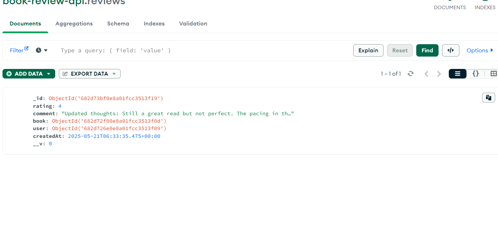

# Book Review API

A RESTful API for a Book Review system built with Node.js, Express, and MongoDB.

## Features

- User authentication with JWT
- CRUD operations for books and reviews
- Pagination and filtering
- Search functionality
- Average ratings for books

## Table of Contents

- [Database Schema](#database-schema)
- [Prerequisites](#prerequisites)
- [Installation](#installation)
- [Running the Application](#running-the-application)
- [API Endpoints](#api-endpoints)
- [Example API Requests](#example-api-requests)
- [Design Decisions](#design-decisions)
- [Future Improvements](#future-improvements)

## Database Schema

### User Model
```
{
  name: String,
  email: String (unique),
  password: String (hashed),
  createdAt: Date
}
```

### Book Model
```
{
  title: String,
  author: String,
  genre: String,
  description: String,
  publishedYear: Number,
  publisher: String,
  isbn: String,
  createdAt: Date,
  user: ObjectId (reference to User)
}
```

### Review Model
```
{
  rating: Number (1-5),
  comment: String,
  createdAt: Date,
  book: ObjectId (reference to Book),
  user: ObjectId (reference to User)
}
```

## Prerequisites

- Node.js (v14+)
- MongoDB (local or Atlas)
- npm or yarn

## Installation

1. **Clone the repository**
   ```bash
   git clone https://github.com/yourusername/book-review-api.git
   cd book-review-api
   ```

2. **Install dependencies**
   ```bash
   npm install
   ```

3. **Set up environment variables**
   
   Create a `.env` file in the root directory with the following content:
   ```
   PORT=3000
   MONGODB_URI=mongodb://localhost:27017/book-review-api
   JWT_SECRET=your_jwt_secret_key_here
   JWT_EXPIRE=7d
   ```

## Running the Application

### Development Mode
```bash
npm run dev
```

### Production Mode
```bash
npm start
```

## API Endpoints

### Authentication Routes
| Method | Endpoint | Description | Access |
|--------|----------|-------------|--------|
| POST | `/api/v1/auth/signup` | Register a new user | Public |
| POST | `/api/v1/auth/login` | Authenticate and return a token | Public |
| GET | `/api/v1/auth/me` | Get current logged in user | Protected |

### Book Routes
| Method | Endpoint | Description | Access |
|--------|----------|-------------|--------|
| POST | `/api/v1/books` | Add a new book | Protected |
| GET | `/api/v1/books` | Get all books (with pagination and filters) | Public |
| GET | `/api/v1/books/:id` | Get book details by ID | Public |
| GET | `/api/v1/books/search` | Search books by title or author | Public |

### Review Routes
| Method | Endpoint | Description | Access |
|--------|----------|-------------|--------|
| POST | `/api/v1/books/:bookId/reviews` | Submit a review for a book | Protected |
| PUT | `/api/v1/reviews/:id` | Update your own review | Protected |
| DELETE | `/api/v1/reviews/:id` | Delete your own review | Protected |

## Example API Requests

### Register a New User
```bash
curl -X POST http://localhost:3000/api/v1/auth/signup \
  -H "Content-Type: application/json" \
  -d '{
    "name": "John Doe",
    "email": "john@example.com",
    "password": "password123"
  }'
```

### Login
```bash
curl -X POST http://localhost:3000/api/v1/auth/login \
  -H "Content-Type: application/json" \
  -d '{
    "email": "john@example.com",
    "password": "password123"
  }'
```

### Create a Book (Authenticated)
```bash
curl -X POST http://localhost:3000/api/v1/books \
  -H "Content-Type: application/json" \
  -H "Authorization: Bearer YOUR_TOKEN_HERE" \
  -d '{
    "title": "The Great Gatsby",
    "author": "F. Scott Fitzgerald",
    "genre": "Classic",
    "description": "The story primarily concerns the young and mysterious millionaire Jay Gatsby and his quixotic passion and obsession with the beautiful former debutante Daisy Buchanan.",
    "publishedYear": 1925,
    "publisher": "Charles Scribner'\''s Sons"
  }'
```

### Get All Books with Pagination
```bash
curl -X GET "http://localhost:3000/api/v1/books?page=1&limit=10&genre=Classic"
```

### Search for Books
```bash
curl -X GET "http://localhost:3000/api/v1/books/search?query=gatsby"
```

### Add a Review for a Book (Authenticated)
```bash
curl -X POST http://localhost:3000/api/v1/books/BOOK_ID_HERE/reviews \
  -H "Content-Type: application/json" \
  -H "Authorization: Bearer YOUR_TOKEN_HERE" \
  -d '{
    "rating": 5,
    "comment": "This is an amazing book! Highly recommended."
  }'
```

## Design Decisions

1. **Authentication**: JWT was chosen for its stateless nature and scalability.
2. **Database Schema**: Relationships between books, users, and reviews are established using MongoDB references.
3. **Error Handling**: Centralized error handling middleware for consistent error responses.
4. **Pagination**: Implemented pagination for books and reviews to optimize performance.
5. **Search**: Case-insensitive search functionality for book titles and authors.

## Future Improvements

- Add book cover image upload
- Implement rate limiting
- Add user roles (admin, moderator)
- Add more advanced filtering and sorting options
- Add unit and integration tests



